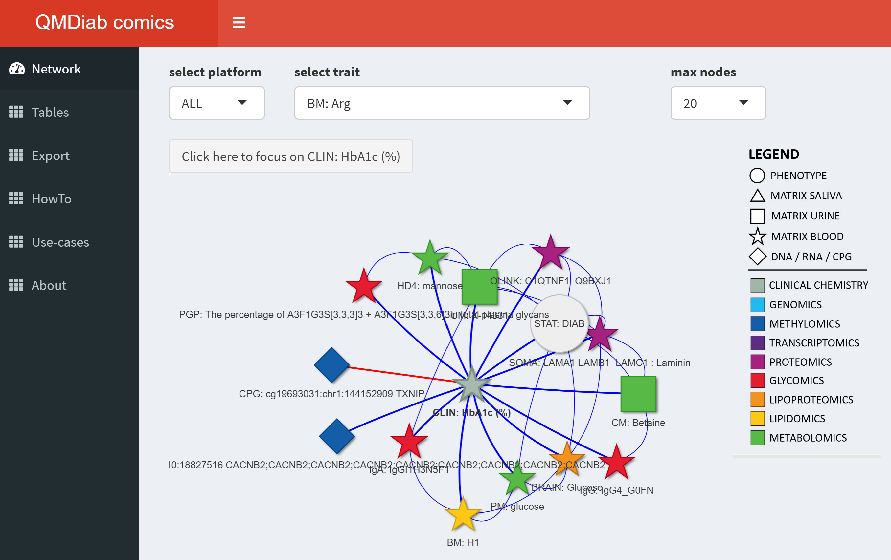
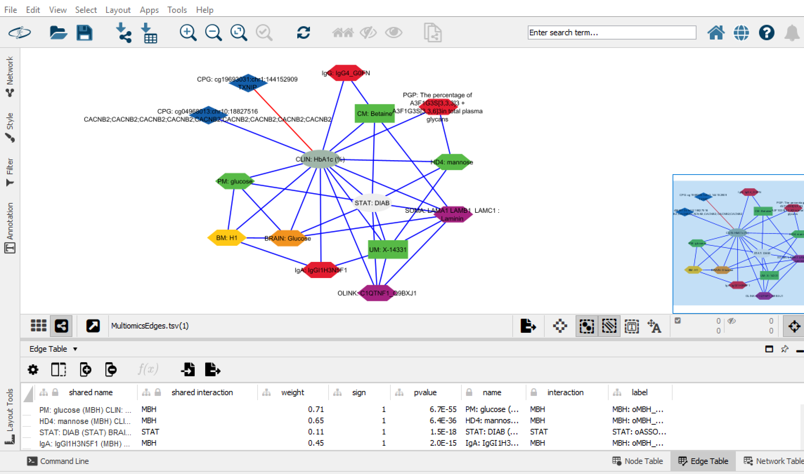

# comics
**The Molecular Human – A Roadmap of Molecular Interactions Linking Multiomics Networks with Disease Endpoints**

This is the GitHub page for the *comics* multiomics web-server.

*Comics* is a [shiny interface](http://comics.metabolomix.com) to the [**The Molecular Human**](http://www.metabolomix.com/comics) and provides a visualization of over 34,000 associations between over 8,700 multiomics traits and disease endpoints.

The underlying networks are derived from 18 technically diverse deep molecular phenotyping (omics-)platforms analyzing urine, blood, and saliva samples from up to 391 participants of the multi-ethnic diabetes case-control study [QMDiab](https://academic.oup.com/jcem/article/99/3/E479/2537128).

The links between the multiomics traits include partial correlations between traits from the same platform (GGMs), mutual best hits for pairwise all-against-all correlations between platforms, genome-wide, epigenome-wide and transcriptome-wide multiomics and disease associations, and associations with QMDiab clinical endpoints.

Details of the *comics* server and its underlying multiomics networks can be found on the [*comics* homepage](http://www.metabolomix.com/comics/).

## Running comics via a web server 
The *comics* web server is available following this link: http://comics.metabolomix.com.

## Running comics locally using docker
You need to download and install docker as described [here](https://www.docker.com/get-started/).

Then pull the docker image `ghcr.io/karstensuhre/comics` using the docker GUI or run the following command line:

```
docker run --detach --name comics -p 8080:3838 ghcr.io/karstensuhre/comics
```

Navigate to your browser and open the following page: http://localhost:8080.

## Running comics locally in RStudio
All files required to run comics locally using [RStudio](https://www.rstudio.com) are in the [./assets](./assets) directory of this GitHub repository. Start-up `rstudio` in with the ./assets as working directory and then launch `app.R` as a shiny app.

Note: you need to have the following libraries installed in RStudio:
```
install.packages("readxl")
install.packages("tidyverse")
install.packages("visNetwork")
install.packages("shiny")
install.packages("shinydashboard")
install.packages("DT")
```

Here is a screenshot of the *comics* server:



## Viewing the *The Molecular Human* without using the `comics` server

The *comics* server is a convenient interface to **The Molecular Human**. It allows to navigate the neighborhoods of individual multiomics and disease traits. However, more complex network analyses require more spohisticated tools. For this purpose we provide a [cytoscape](https://cytoscape.org/) version of the full network with matching shapes and colors.

Download and open [this file](cytoscape/MultiomicsNetwork.cys) using `cytoscape`.

Here is a screenshot of the *The Molecular Human* opened in `cytoscape`:



